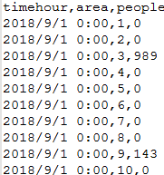

交通区域客流预测
======
参考地址[DeepST](https://github.com/lucktroy/DeepST)

参考文档：Deep Spatio-Temporal Residual Networks for Citywide Crowd Flows Prediction

主要修改了scripts\papers\AAAI17\BikeNYC目录（ST-ResNet论文解读word）


## 模型应用

针对的是区域客流预测，将客流数据分成规则的16\*8的数据格式（通过经纬度平均划分16\*8的标准块），数据为area.csv




## 模型运行

```
python3 exptBikeNYC.py
```


## 模型预测

```
python3 exptBikeNYC.py
```